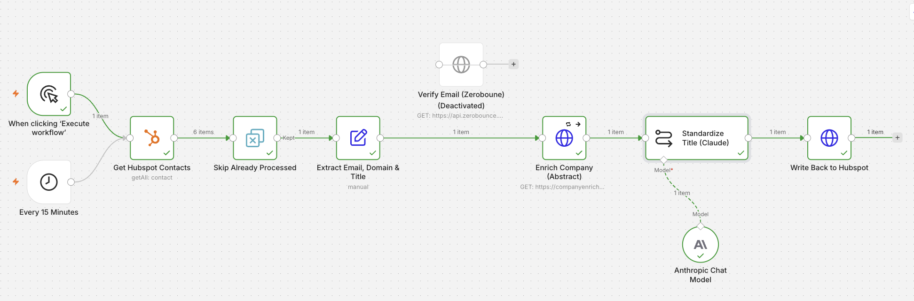
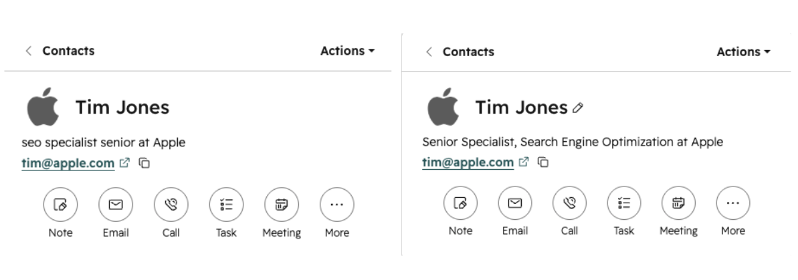

# ✨ LeadPolish

**🤖 An automated HubSpot contact enricher, built on a free stack (n8n + Claude).**

When a new contact lands in HubSpot, LeadPolish picks it up on a schedule, enriches it, uses AI to standardize the job title, and writes the result back to the contact record. No manual steps.

Built end to end on free tiers as a marketing-operations project.

## 🎯 What it does

Inbound contacts arrive with messy, inconsistent data. Job titles are the worst offenders ("vp mktg", "sr dir biz dev"), which makes segmentation and reporting unreliable. LeadPolish standardizes them automatically and enriches the record along the way, so the CRM stays clean without anyone touching a spreadsheet.

Every 15 minutes it:

1. 📇 Pulls contacts from HubSpot
2. 🔁 Skips any it has already processed, so each contact runs exactly once
3. ✂️ Pulls out the email, domain, and title
4. 🏢 Looks up the company from the domain (Abstract API)
5. 🧠 Standardizes the job title with Claude
6. ✅ Writes the cleaned title back to a dedicated HubSpot field, leaving the original untouched

## ⚙️ How it works

Flow: Every 15 Minutes -> Get HubSpot Contacts -> Skip Already Processed -> Extract Email, Domain & Title -> Enrich Company (Abstract) -> Standardize Title (Claude) -> Write Back to HubSpot

- **⏰ Every 15 Minutes.** A Schedule Trigger runs the workflow on a timer. A manual trigger sits alongside it for testing.
- **📇 Get HubSpot Contacts.** Reads contacts from HubSpot using a private service key.
- **🔁 Skip Already Processed.** Uses n8n's "remove items processed in previous executions," keyed on the HubSpot contact ID, so a contact is enriched once and never re-processed. This is what makes it safe to leave running.
- **✂️ Extract Email, Domain & Title.** Pulls email, domain, and current title out of HubSpot's nested response into clean, flat fields.
- **🏢 Enrich Company (Abstract).** Looks up the domain to pull company name, industry, size, and more.
- **🧠 Standardize Title (Claude).** A few-shot prompt rewrites messy titles into a consistent "Role, Function" format, and returns "Unknown" for blanks or junk. The write body is built with JSON.stringify so an unexpected character in a title can never break the request.
- **✅ Write Back to HubSpot.** A PATCH to HubSpot's CRM v3 API sets a custom "Standardized Job Title" property. The original job title is preserved, so the before and after are both visible on the record.

Before and after on a contact record:

## 📮 A note on email verification

The workflow includes a built **Verify Email (ZeroBounce)** node, but it currently sits off to the side rather than in the live path, for two honest reasons:

1. The free tier's monthly verification credits were used up during development.
2. Leaving a *deactivated* node inside the sequence interferes with how n8n links each result back to its original contact, which broke the downstream contact ID lookup.

So it lives on the canvas as a demonstrated, working step that wires back in the moment you have verification credits. This is a real free-tier tradeoff, not a missing feature.

## 🧩 Design decisions

- **⚡ Per-lead and real-time by design.** It processes new contacts as they arrive rather than in big batches, so external rate limits rarely come into play during normal operation.
- **🔒 Idempotent.** The Skip Already Processed step guarantees each contact is handled exactly once across scheduled runs. No wasted API calls, no overwriting.
- **🧾 Non-destructive writes.** Enriched values go into new custom properties. Source data is never overwritten, which keeps the before and after visible and makes the workflow safe to run against real records.
- **🔌 REST API for the write-back.** The HubSpot connector node can't reliably write to custom fields, so the write uses HubSpot's CRM v3 API directly through an HTTP request.
- **🛟 Tolerant of missing data.** Enrichment fields are frequently blank (private companies, free email domains). Every step handles empty values instead of breaking, and a failed lookup routes the contact through rather than halting the run.

## 💸 Working on a free stack, and its limits

LeadPolish runs on free tiers end to end, which is the point: it shows what's achievable on a limited budget. That also means real constraints, worth being upfront about.

- **📧 Email verification (ZeroBounce):** around 100 checks per month free. Used up during development, so it's parked (see the note above).
- **🏢 Company enrichment (Abstract):** the free tier throttles to roughly one request per second, so a burst of new contacts in a single run needs spacing, handled with retry-and-backoff or by processing one at a time.
- **🧠 Title standardization (Claude):** runs on a small, fast model with no practical per-run limit, so this is the always-on piece.
- **⏱️ Triggering:** this polls every 15 minutes. Instant, event-driven triggering needs webhooks, which sit behind a paid HubSpot tier.

The takeaway: on a zero-cost stack this comfortably handles a steady trickle of new leads, standardizing every title and enriching whatever the free tiers allow. A one-time bulk backfill of an existing list is the case that needs deliberate throttling. Scaling up is a matter of upgrading one service at a time, not rebuilding.

## 🚀 Run it yourself

1. Get n8n (cloud trial or self-hosted) and import `workflow.json` via the three-dot menu -> Import.
2. Create the accounts you want to use: HubSpot (free), Anthropic (for Claude), and optionally ZeroBounce and Abstract API.
3. Add the credentials in n8n. Imports bring the nodes but not the secrets, so each needs reconnecting:
   - HubSpot: a private app / service key with contact read and write scopes
   - Anthropic: an API key
   - Abstract (and ZeroBounce if you re-enable it): their API keys
4. In HubSpot, create a custom contact property named "Standardized Job Title" (single-line text).
5. Open each node and reconnect its credential.
6. Run once manually to test, then set the workflow Active.

## 🛠️ Built with

n8n, HubSpot CRM, Anthropic Claude (Haiku), Abstract API, and ZeroBounce (parked).

## 📌 What it demonstrates

REST API integration with multiple auth patterns, AI prompt design for structured output, CRM data modeling, idempotent scheduled automation, and practical error and rate-limit handling.
